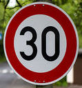
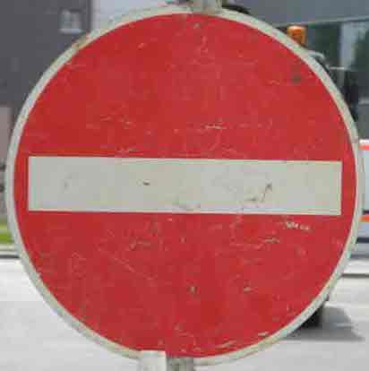
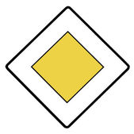
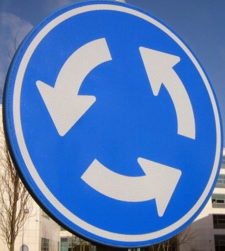
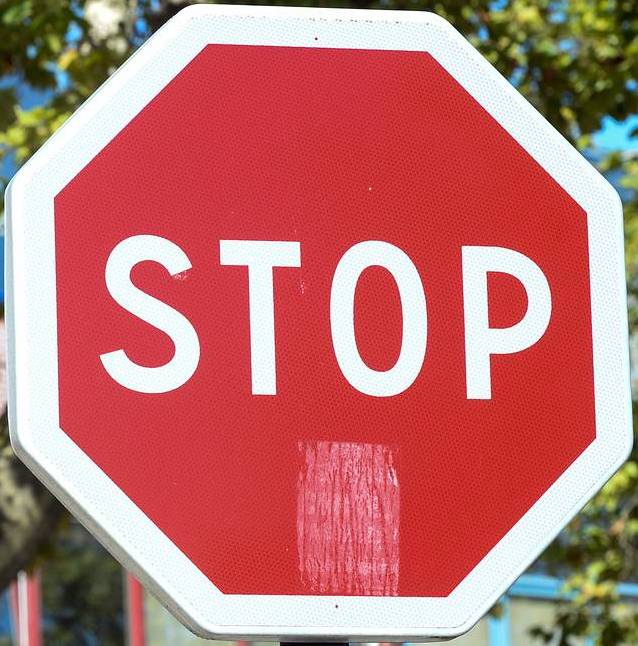

# **Traffic Sign Recognition** 

## Writeup

**Build a Traffic Sign Recognition Project**

The goals / steps of this project are the following:

* Load the data set (see below for links to the project data set)
* Explore, summarize and visualize the data set
* Design, train and test a model architecture
* Use the model to make predictions on new images
* Analyze the softmax probabilities of the new images
* Summarize the results with a written report

## Rubric Points
### Here I will consider the [rubric points](https://review.udacity.com/#!/rubrics/481/view) individually and describe how I addressed each point in my implementation.  

---
### Writeup / README

#### 1. Provide a Writeup / README that includes all the rubric points and how you addressed each one.

All the rubric points along with my comments and answers are described in this file.

Here is the link to my [project code](https://github.com/DruidKuma/Self-Driving-Car-ND_Project-2-TrafficSignsClassifier/blob/master/Traffic_Sign_Classifier.ipynb)

Here is the link to the [executed code in HTML format](https://github.com/DruidKuma/Self-Driving-Car-ND_Project-2-TrafficSignsClassifier/blob/master/Traffic_Sign_Classifier.html)

### Data Set Summary & Exploration

#### 1. Provide a basic summary of the data set. In the code, the analysis should be done using python, numpy and/or pandas methods rather than hardcoding results manually.

I used the plain Python and Numpy library (for image shape) 
to calculate summary statistics of the traffic signs data set:

* The size of training set is 34799
* The size of the validation set is 4410
* The size of test set is 12630
* The shape of a traffic sign image is (32, 32, 3)
* The number of unique classes/labels in the data set is 43

#### 2. Include an exploratory visualization of the dataset.

Here is an exploratory visualization of the data set. It is a bar chart showing how many examples are there for every class label in the training data.

As we can see, values differ from min examples for '0' label - 180 to max examples for '2' label - 2010.
For some labels there are too few training examples, and we should cope with this issue by adding more fake data.

### Design and Test a Model Architecture

#### 1. Describe how you preprocessed the image data. What techniques were chosen and why did you choose these techniques? Consider including images showing the output of each preprocessing technique. Pre-processing refers to techniques such as converting to grayscale, normalization, etc. (OPTIONAL: As described in the "Stand Out Suggestions" part of the rubric, if you generated additional data for training, describe why you decided to generate additional data, how you generated the data, and provide example images of the additional data. Then describe the characteristics of the augmented training set like number of images in the set, number of images for each class, etc.)

As a first step, I decided to convert the images to grayscale to cut down the range of possible values and to reduce the depth of the input data (actually, cut the RGB channels) from 3 to 1.

Previously I've also tried variant with converting image to YUV channel as was described in the attached to project paper, but haven't got significant accuracy increase with such approach, rather than with grayscale conversion.

Here is an example of a traffic sign image before and after grayscaling.

 

The last step in normalizing the image I chose, was the global contrast normalization. I've used it to even more narrow the range of possible pixel values.

Here is an example of a traffic sign image before and after appling the GCN.
The changes are roughly invisible for the eye, but they gave around 12-15% more to the accuracy of the model!
I've tried to train with and without GCN, and the results were pretty poor without it (around 79-82%), but flew high with it (up to 95%). Magic! :)

I decided to generate additional data because (as opposed to the bar chart before) there was too few examples of training data for some of the classes.
I think, the best approach for solving this was to generate more images for the smallest columns in shown bar chart along with increasing overall training dataset for all classes, but I've decided to keep this simpler and just added 3 more fake images for every single entry in the dataset.

To add more data, I used image augmentation. I took rougly same approach as in the attached to project paper. I have implemented image rotation (-15/+15 degrees), scaling (by factors of 0.9/1.1) and translating (-2/+2 pixels) and used them with random parameters within ranges and in random order.

Here is an example of an original image and an augmented image:

The difference between the original data set and the augmented data set is the following:
Original data set: 34799 entries
Augmented data set: 104397 entries

This gave me 139196 entries total for training.

#### 2. Describe what your final model architecture looks like including model type, layers, layer sizes, connectivity, etc.) Consider including a diagram and/or table describing the final model.

My final model consisted of the following layers:

| Layer         		|     Description	        					| 
|:---------------------:|:---------------------------------------------:| 
| Input         		| 32x32x1 grayscaled image   					| 
| Convolution 5x5     	| 1x1 stride, valid padding, outputs 28x28x6 	|
| RELU					|												|
| Max pooling	      	| 2x2 stride,  outputs 14x14x6 					|
| Convolution 5x5	    | 1x1 stride, valid padding, outputs 10x10x16 	|
| RELU					|												|
| Max pooling	      	| 2x2 stride,  outputs 5x5x16 					|
| Flatten		      	| outputs 400				 					|
| Fully connected		| outputs 120  									|
| RELU					|												|
| Fully connected		| outputs 84									|
| RELU					|												|
| Fully connected		| outputs 43									|
| Softmax				| cross-entropy with one-hot for 43 labels		|
 

#### 3. Describe how you trained your model. The discussion can include the type of optimizer, the batch size, number of epochs and any hyperparameters such as learning rate.

To train the model, I used standart optimizer from the LeNet lab - AdamOptimizer. The loss operation to minimize was the reduce mean over the softmax cross entropy.

I've chosen the following values for the hyperparameters:

* Batch size: 128
* Number of epochs: 10
* Learning rate: 0.003

#### 4. Describe the approach taken for finding a solution and getting the validation set accuracy to be at least 0.93. Include in the discussion the results on the training, validation and test sets and where in the code these were calculated. Your approach may have been an iterative process, in which case, outline the steps you took to get to the final solution and why you chose those steps. Perhaps your solution involved an already well known implementation or architecture. In this case, discuss why you think the architecture is suitable for the current problem.

My final model results were:

* training set accuracy of 98.9%
* validation set accuracy of 96.4% 
* test set accuracy of 93.4%

Architecture

* I've chosen the standard LeNet architecture from the previous lab.
* It is known as one of the primary architectures for such problems, it passed within tests over time. There is much more information on the web about this approach, and I have digged into it and understood how it works, so I've chosen it as the best known and understandable architecture for me now. 
* I have rerun the model training and validation multiple times after choosing final values for hyperparameters, and each time the accuracy on the test set was not lower than 93.4% (max of 95.6%), comparing with validation set accuracy of 94.5% (max of 97%). I suggest these are pretty good results for accepting the model.

### Test a Model on New Images

#### 1. Choose five German traffic signs found on the web and provide them in the report. For each image, discuss what quality or qualities might be difficult to classify.

Here are five German traffic signs that I found on the web:

    

Some of the images might be difficult to classify because there is some noise in the region of interest (talking about blurred trees and buildings on the background).
As detecting the region of interest on the whole image was not part of this project, images were cropped manually before preprocessing.
Also images are of different sizes, which is a great sample to apply resize (as chosen architecture wants images of 32x32 size).

#### 2. Discuss the model's predictions on these new traffic signs and compare the results to predicting on the test set. At a minimum, discuss what the predictions were, the accuracy on these new predictions, and compare the accuracy to the accuracy on the test set.

Here are the results of the prediction:

| Image			        |     Prediction	        					| 
|:---------------------:|:---------------------------------------------:| 
| Speed limit (30km/h)	| Speed limit (30km/h)							| 
| No entry     			| No entry 										|
| Priority road			| Priority road									|
| Roundabout mandatory 	| Roundabout mandatory			 				|
| Stop					| Stop			      							|

The model was able to correctly guess 5 of the 5 traffic signs, which gives an accuracy of 100%. This compares favorably to the accuracy on the test set of 93.4%.
After rerunning 20 times on same model, model always gave correct predictions, which stands for a good mark.

####3. Describe how certain the model is when predicting on each of the five new images by looking at the softmax probabilities for each prediction. Provide the top 5 softmax probabilities for each image along with the sign type of each probability.

The code for making predictions on my final model is located in the last cell of Step 3 in the Ipython notebook.

For the most of the images, the model is pretty sure to generate correct outputs with percentage near to 100.
Let's look at all of them one by one:

For the "Speed limit (30km/h)" sign probabilities were:

| Probability         	|     Prediction	        					| 
|:---------------------:|:---------------------------------------------:| 
| around 1     			| Speed limit (30km/h)							| 
| 8.8e-16  				| Speed limit (50km/h)							|
| 3.9e-16				| Speed limit (80km/h)							|
| 3.5e-19      			| Speed limit (20km/h)			 				|
| 6.6e-23			    | Speed limit (60km/h)							|

As we can see, model is pretty sure about this sign, giving around top probabilities only signs, related to the tested sign (speed limits).

For the "No entry" sign probabilities were:

| Probability         	|     Prediction	        					| 
|:---------------------:|:---------------------------------------------:| 
| around 1     			| No entry										| 
| 5.6e-26  				| No passing									|
| 5.0e-28				| Speed limit (100km/h)							|
| 1.1e-28      			| Yield			 								|
| 4.0e-31			    | No passing for vehicles over 3.5 metric tons	|

For the "Priority Road" sign probabilities were:

| Probability         	|     Prediction	        					| 
|:---------------------:|:---------------------------------------------:| 
| around 1     			| Priority Road									| 
| 4.4e-31  				| No passing									|

The rest of probabilities were complete zeros, so the model even more sure about this sign (and this is pretty clear, as we don't have many signs which is very similar to this, as we have, e.g. in speed limit signs)

For the "Roundabout mandatory" sign probabilities were:

| Probability         	|     Prediction	        					| 
|:---------------------:|:---------------------------------------------:| 
| 9.9e-01     			| Roundabout mandatory							| 
| 1.1e-05  				| Priority road									|
| 1.5e-17				| Speed limit (100km/h)							|
| 1.8e-18      			| End of no passing by vehicles over 3.5 m tons	|
| 2.3e-19			    | Keep right									|

For the "Stop" sign probabilities were:

| Probability         	|     Prediction	        					| 
|:---------------------:|:---------------------------------------------:| 
| 9.8e-01     			| Stop											| 
| 1.9e-02  				| Speed limit (20km/h)							|
| 2.8e-05				| Keep left										|
| 1.1e-05      			| Speed limit (120km/h)							|
| 2.8e-07			    | Speed limit (60km/h)							|

As far as we can see, the last sign has a small bit of confusion about its predictions, but, nevertheless, it is sure about the correct ouput at around 98%, having the next possible prediction of about 2%.